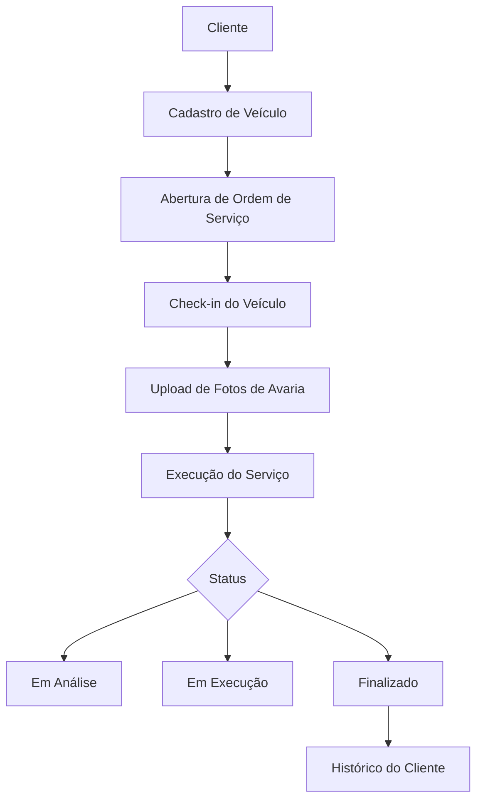
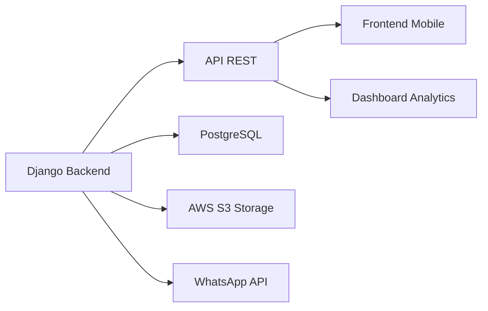
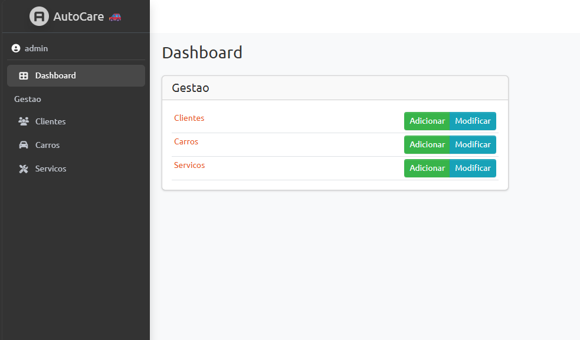
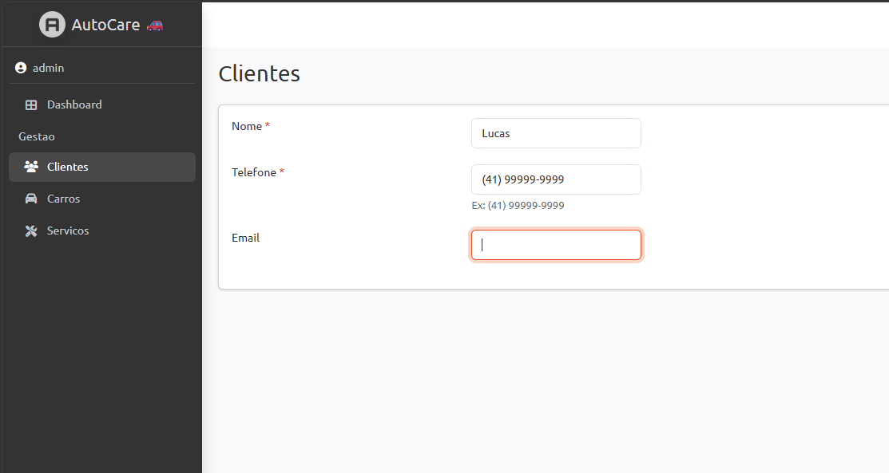
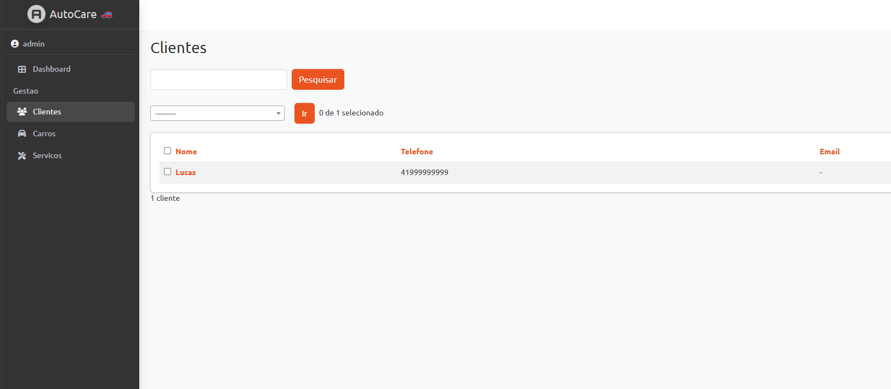
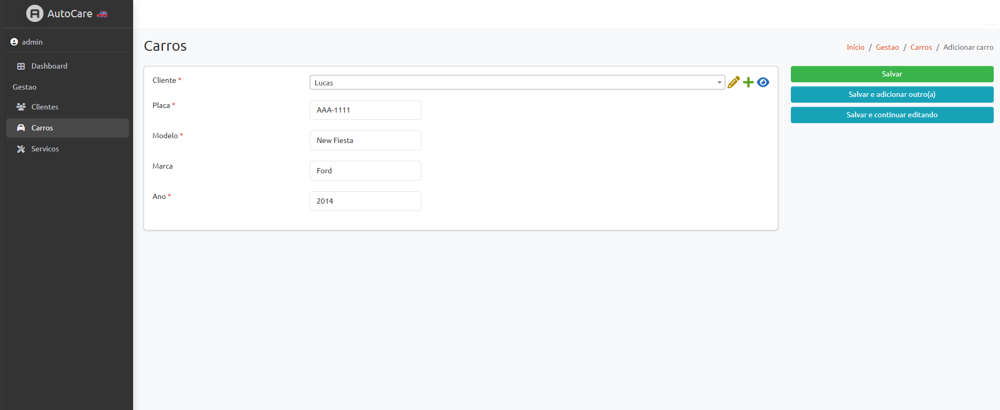
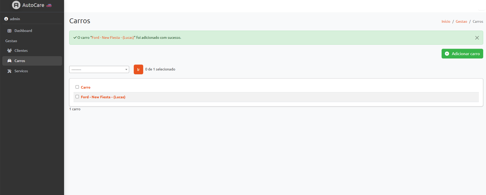
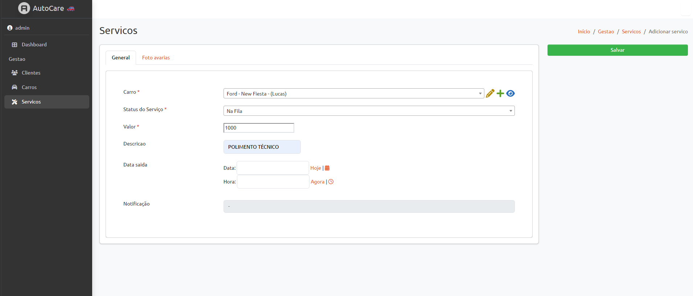
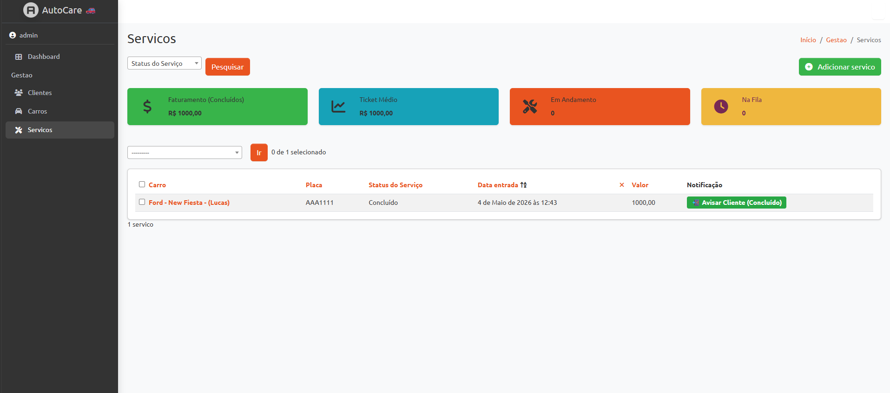
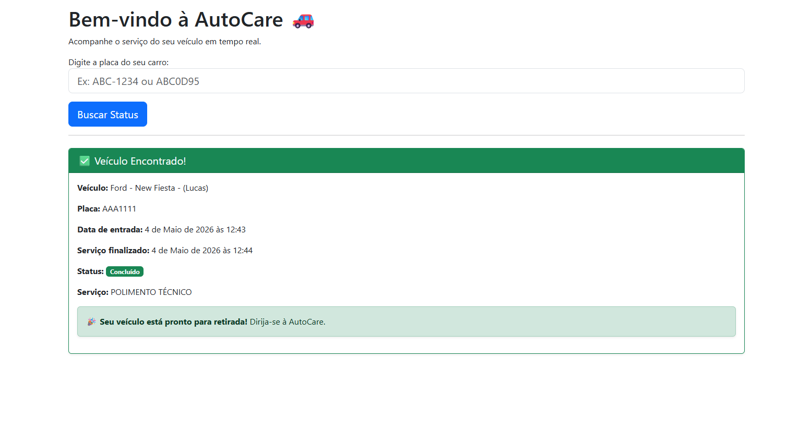

# 🚗 AutoCare - Sistema de Gestão para Estética Automotiva


---

## 📌 Visão Geral do Sistema

O **AutoCare** é um sistema web full-stack desenvolvido em Django com foco em digitalizar e estruturar o fluxo operacional de estéticas automotivas.

Ele funciona como um **ERP leve especializado no setor automotivo**, centralizando todo o ciclo de atendimento:

- Cadastro de clientes
- Gestão de veículos
- Abertura e acompanhamento de serviços
- Registro visual de avarias
- Controle de status operacional

O sistema transforma processos manuais em um fluxo **digital, rastreável e auditável**.

---

## 🧠 Problema Resolvido

Em estéticas reais, existem dois gargalos principais:

### ❌ Falta de histórico confiável

Não existe registro estruturado do estado do veículo no momento da entrada.

### ❌ Desorganização operacional

Serviços são controlados manualmente, sem padronização ou rastreio central.

---

## ⚙️ Fluxo do Sistema



---

## 🏗️ Arquitetura do Sistema

### 🧱 Modelagem de Dados

O sistema segue uma arquitetura relacional normalizada:

```
Cliente (1) ──── (N) Veículos
Veículo (1) ──── (N) Ordens de Serviço
Ordem de Serviço (1) ──── (N) Imagens de Inspeção
```

### 🔐 Características da arquitetura:

- Integridade referencial via Django ORM
- Histórico completo por veículo
- Escalabilidade horizontal do modelo

---

## 🧠 Regras de Negócio

### 🔎 Normalização de dados

- Placas padronizadas (uppercase + sanitização)
- Prevenção de duplicidade de registros de clientes

### 🛡️ Validação em múltiplas camadas

- Front-end: validação básica
- Back-end: regras no `Model.save()`
- Banco de dados: constraints e integridade relacional

### 📸 Registro de evidências

- Upload de múltiplas imagens no check-in
- Associação direta com a Ordem de Serviço

---

## 🗄️ Banco de Dados

O projeto utiliza **PostgreSQL** como banco principal.

### Por que PostgreSQL?

- Relacionamentos complexos (1:N, N:N)
- Alta confiabilidade de dados
- Escalabilidade para produção
- Compatibilidade com cloud (AWS, Render)

---

## 🌍 Ambiente Atual

⚠️ O sistema está em execução **100% local (ambiente de desenvolvimento)**.

Não há deploy em produção no momento.

---

## 🔐 Configuração do Ambiente

⚠️ O projeto depende de variáveis de ambiente **e requer PostgreSQL instalado e rodando localmente** antes da execução.

Sem o PostgreSQL configurado, o sistema não irá iniciar corretamente.

### 📌 Requisitos obrigatórios:

- Python 3.14+
- PostgreSQL instalado e em execução local
- Banco de dados criado (ex: `autocare`)
- Usuário configurado no PostgreSQL com permissões no banco

### 📄 `.env.example`

```env
DB_NAME=CHANGE ME
DB_USER=CHANGE ME
DB_PASSWORD=CHANGE ME
DB_HOST=CHANGE ME
DB_PORT=CHANGE ME
SECRET_KEY=CHANGE ME (SECRET KEY USE LINK: https://djecrety.ir/)
```

## 🚀 Execução Local

```bash
# Clonar repositório
git clone https://github.com/lucasvchimelli
cd AutoCare

# Criar ambiente virtual
python -m venv venv
venv\Scripts\activate

# Instalar dependências
pip install -r requirements.txt

# Aplicar migrações
python manage.py migrate

# Rodar servidor
python manage.py runserver

abas: home (Cliente) e admin (Gerenciamento)
```

---

## 🧱 Arquitetura Técnica (Visão Sistema)

### 🔹 Backend

- Django (Monólito modular)
- ORM para abstração de banco
- Regras de negócio centralizadas no servidor

### 🔹 Banco de Dados

- PostgreSQL
- Modelo relacional normalizado

### 🔹 Frontend

- Django Templates
- UI responsiva para operação

---

## 📊 Possível evolução (arquitetura futura)



---

## 📷 Screenshots do Sistema

Abaixo estão as principais telas do sistema AutoCare, demonstrando o fluxo completo de gestão.

---

### 🏠 Dashboard Administrativo



---

### 👤 Clientes

#### ➕ Cadastro de Cliente



#### 📋 Lista de Clientes



---

### 🚗 Veículos

#### ➕ Cadastro de Veículo



#### 📋 Lista de Veículos



---

### 🧾 Serviços

#### ➕ Cadastro de Serviço



#### 📋 Lista de Serviços



---

### 👤 Portal do Cliente 

#### 🏠 Tela do Cliente (consulta de status)


